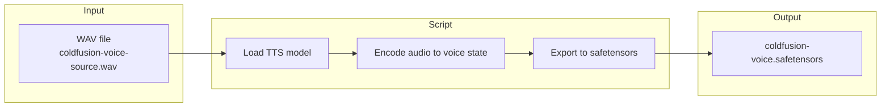

# Voice Cloning: WAV to Safetensors Plan

## Goal
Convert `voices/sources/coldfusion-voice-source.wav` to a `.safetensors` voice file for fast loading during TTS generation.

---

## Why Safetensors?
- **Faster**: Skip audio encoding at runtime — load pre-processed voice state directly
- **Reusable**: One-time conversion, use many times in `/voice/generate`
- **Portable**: Small file (~few MB) vs raw WAV

---

## Flow Diagram



---

## Implementation Steps

| Step | Action |
|------|--------|
| 1 | Create `export_voice.py` at project root |
| 2 | Load TTS model (`TTSModel.load_model()`) |
| 3 | Call `get_state_for_audio_prompt(audio_path, truncate=True)` |
| 4 | Call `export_model_state(voice_state, output_path)` |
| 5 | Output to `voices/safetensors/coldfusion-voice.safetensors` |

---

## Usage (After Script)

```python
# In server: load custom voice from safetensors (no encoding needed)
voice_state = tts_model.get_state_for_audio_prompt("voices/safetensors/coldfusion-voice.safetensors")
audio = tts_model.generate_audio(voice_state, text)
```

---

## Edge Cases to Handle

| Case | Mitigation |
|------|------------|
| WAV not found | Fail with clear error; check path |
| Audio &lt; 3 sec | Warning; Pocket TTS recommends 3–10 sec |
| Audio &gt; 30 sec | `truncate=True` cuts to first 30 sec |
| Corrupt/invalid audio | Try/except; log decode error |
| No voice-cloning model | Needs HuggingFace login + terms at [pocket-tts](https://huggingface.co/kyutai/pocket-tts) |

---

## File Layout

```
TTS-server/
  export_voice.py                      # conversion script (project root)
  voices/
    sources/
      coldfusion-voice-source.wav      # input
    safetensors/
      coldfusion-voice.safetensors     # output
```
