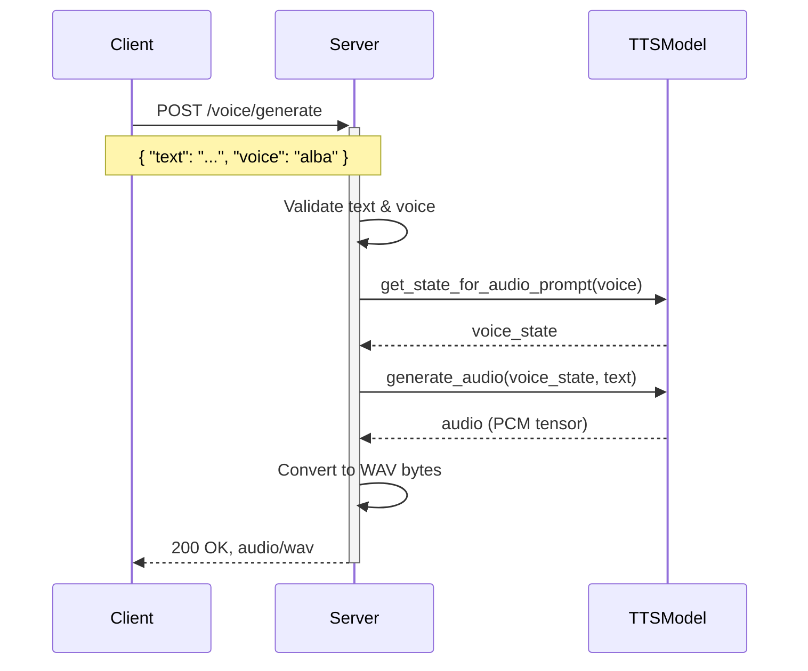
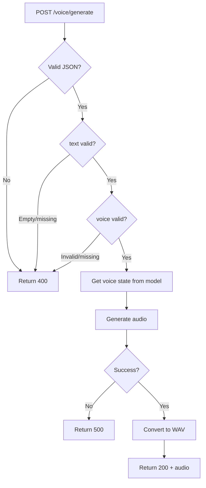
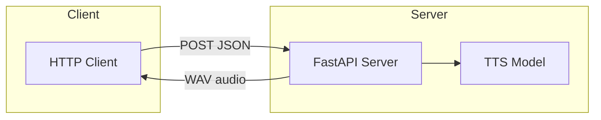

## Requirement:
This code is working perfectly. Can we write a separate file for a simple HTTP server in which we can request for a voice output.

API Method: POST
URL: /voice/generate
Request body (application/json):
{
  "text": "Hai, how are you",
  "voice": "alba",
}

Response = audio output

**Deliverable:** A separate file `server.py` containing a FastAPI HTTP server.

---

## API Flow (Sequence Diagram)

---

## Request Processing Flow

---

## System Architecture

